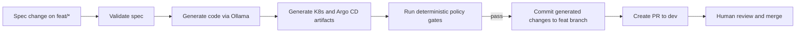
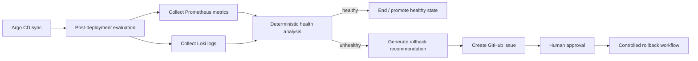

# Spec-Driven DevOps PoC

This repository is a proof of concept for a **spec-driven DevOps** workflow built with open-source tools and a local LLM runtime.

The system is built around two main flows:

1. **Spec-driven delivery**: a developer updates a spec on a `feat/*` branch, the pipeline generates code and GitOps artifacts, deterministic policy gates verify the result, and a PR is created to `dev` for human review.
2. **Post-deployment monitoring and rollback recommendation**: after Argo CD sync, the system collects evidence from Prometheus and Loki, analyzes deployment health, and creates a rollback recommendation for human approval when needed.

Core control model:

- Agent proposes
- Pipeline executes
- Human approves

---

## Design Documents

- [Target-state design](docs/design.md)
- [PoC 1: Spec-driven delivery](docs/poc-1-spec-driven-delivery.md)
- [PoC 2: Post-deployment monitoring and rollback recommendation](docs/poc-2-post-deployment-monitoring.md)
- [Assignment requirements](docs/requirement.md)
- [ADR: tooling choices](docs/adr-001-tooling.md)

---

## Architecture Summary

### Main components

- **Specs**: YAML files under `applications/*/specs/` define the intended change.
- **Agent layer**: `devops/agent/` resolves specs and generates application and GitOps artifacts. Ollama is used for local code generation.
- **Policy layer**: `devops/policy/` performs deterministic spec validation and generated-output checks.
- **CI/CD layer**: GitHub Actions runs on a self-hosted macOS runner because the workflows depend on local services such as Ollama and Minikube.
- **GitOps layer**: Argo CD syncs Git-tracked manifests from `devops/k8s/` into Kubernetes.
- **Runtime / observability**: Prometheus and Loki provide deployment and health evidence.
- **Monitoring / rollback recommendation**: post-deployment workflows analyze evidence and open a GitHub issue when rollback should be reviewed.

### Tooling used in this PoC

- Ollama
- GitHub Actions with self-hosted runner
- Argo CD
- Kubernetes / Minikube
- OPA / Rego and Python policy checks
- Prometheus
- Loki

---

## Main Workflows

### 1. Spec-driven delivery



Key points:

- The developer updates the spec first, not application code first.
- The workflow scans for exactly one changed spec file in the feature branch.
- Policy checks run before a PR is created.
- Git remains the source of truth.
- The agent does not merge the PR or deploy directly.

### 2. Post-deployment monitoring and rollback recommendation



Key points:

- Monitoring detection is deterministic.
- AI is used for reasoning and recommendation, not direct control.
- Rollback is proposed through GitHub issues and must be approved before GitOps state changes.

---

## Important Guardrails

- The agent is allowed to generate code, analyze monitoring signals, produce recommendations, and create GitHub issues.
- The agent is not allowed to commit directly to `dev`, merge PRs, modify GitOps state directly, trigger rollback execution directly, or mutate the cluster directly.
- All state-changing actions must go through deterministic pipelines, policy/quality gates, and human approval.

Examples of deterministic policy checks:

- Required spec fields must exist.
- Only supported schema versions are accepted.
- Test requirements must be declared in the spec.
- Swagger documentation must be declared.
- Generated contract values must match the resolved spec.
- Generated routes must match the API routes declared in the spec.
- `GET /health` and `GET /metrics` must exist in the generated app.

---

## Repository Structure

- `applications/`: application-specific specs, code, tests, and Dockerfiles
- `devops/agent/`: spec resolution and code / artifact generation
- `devops/policy/`: deterministic validation and policy gates
- `devops/k8s/`: generated Kubernetes manifests and Argo CD application definitions
- `devops/observability/`: evidence collection, deployment-state resolution, and monitoring analysis
- `devops/state/`: persisted last-known-healthy deployment state
- `scripts/`: helper scripts for generation, gating, image-tag update, and demo flows
- `docs/`: design notes and PoC documents

---

## Workflow Files

- `.github/workflows/feature-workflow.yml`: spec-driven feature branch workflow
- `.github/workflows/spec-driven-build.yml`: generation, gate, build, and publish flow on `dev`
- `.github/workflows/gitops-workflow.yml`: manifest planning, approval, and GitOps update
- `.github/workflows/observability-workflow.yml`: post-deployment evaluation and recommendation
- `.github/workflows/rollback-workflow.yml`: approved rollback execution and verification

---

## Local Prerequisites

To run the PoC end to end, you need:

- Python 3
- Ollama with `qwen2.5:7b`
- Minikube
- kubectl
- Argo CD
- A self-hosted GitHub Actions runner
- Optional: `opa` for Rego-based policy evaluation

This repository is designed for a local demo environment, not for production use as-is.

---

## Setup Plan

This is the recommended local setup order for the full demo:

1. Install Python dependencies
2. Start Ollama and pull the model
3. Start Minikube
4. Install Argo CD
5. Configure the self-hosted GitHub Actions runner
6. Deploy the monitoring stack
7. Run the feature, GitOps, and observability workflows

### 1. Install Python dependencies

```bash
python3 -m venv .venv
. .venv/bin/activate
pip install -r requirements.txt
```

### 2. Install and start Ollama

The generator and evidence summarization flows expect a local Ollama endpoint.

```bash
ollama pull qwen2.5:7b
ollama serve
```

Default endpoint used by the workflows:

- `http://127.0.0.1:11434`

### 3. Start Minikube

The local cluster is the Kubernetes target for Argo CD and the demo applications.

```bash
minikube start --driver=docker --memory=6144 --cpus=4
minikube addons enable ingress
minikube tunnel
```

Keep `minikube tunnel` running in a separate terminal.

### 4. Install Argo CD

Install Argo CD into the cluster first, then bootstrap the app-of-apps manifest from this repo.

```bash
kubectl create namespace argocd
kubectl apply -n argocd -f https://raw.githubusercontent.com/argoproj/argo-cd/stable/manifests/install.yaml
kubectl apply -f devops/argocd/application.yaml
```

This bootstrap points Argo CD to `devops/k8s/argocd/`, where the child `Application` manifests live.

Optional UI access:

```bash
kubectl port-forward svc/argocd-server -n argocd 8080:443
```

### 5. Configure the self-hosted GitHub Actions runner

The workflows depend on local services such as:

- Ollama
- Minikube
- kubectl
- local workspace state

Because of that, the repo is designed to run on a self-hosted GitHub Actions runner.

High-level steps:

1. Create a self-hosted runner in the GitHub repository settings.
2. Install it on the same machine where Ollama and Minikube are running.
3. Start the runner and keep it online while testing the workflows.

The workflow labels currently expect:

- `self-hosted`
- `macOS`

### 6. Deploy the monitoring stack

The monitoring stack manifests live under `devops/observability/minikube/`.

Deploy them with:

```bash
kubectl apply -f devops
```

Optional Grafana access:

```bash
kubectl port-forward svc/grafana -n monitoring 3000:3000
```

Default Grafana credentials in this local setup:

- Username: `admin`
- Password: `admin`

### 7. Run the main workflows

Recommended test sequence:

1. Push a spec change to a `feat/*` branch to trigger `.github/workflows/feature-workflow.yml`
2. Review and merge the PR into `dev`
3. Trigger or observe `.github/workflows/gitops-workflow.yml`
4. Let Argo CD sync the new manifests
5. Let `.github/workflows/observability-workflow.yml` evaluate the deployment
6. If unhealthy, review the rollback issue and approval flow

### Optional local commands

For local validation outside GitHub Actions:

```bash
make install
make generate
make gate
```

---

## Notes

- The repo contains both evolving application examples and workflow experiments. Some service examples are narrower than the target-state design.
- The current documentation should be read with `docs/design.md` and the two PoC notes as the main reference points.
