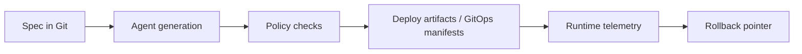

# Spec-Driven DevOps PoC

This repository demonstrates one vertical slice of a spec-driven DevOps system:

`Spec -> Agent -> Policy -> Deploy -> Observe -> Rollback`

The goal is not to show a perfect production platform. It is to show how a small team can move from a requirement to a running, observable, reversible change with reviewable artifacts and machine-enforced controls.

## Architecture

### Spec layer
- Versioned YAML specs live in `applications/expense-workflow-service/specs/`.
- The baseline is `BASELINE.yaml`; feature specs describe one small change over that baseline.
- Specs define the business intent, API contract, deployment intent, and observability assertions.

### Agent layer
- `devops/agent/` reads the resolved spec and generates release artifacts and service code.
- The agent supports a deterministic path for repeatability and an Ollama-backed path for local LLM generation.
- Ollama runs locally and acts as the model endpoint for code generation.

### Policy layer
- `devops/policy/` validates generated artifacts and generated code against the resolved spec.
- Rego policies run through `scripts/gate.sh` when `opa` is available.
- Python checks always run to write evidence files under `build/releases/<release_id>/evidence/`.

### GitHub Actions
- `.github/workflows/spec-driven-build.yml` is the orchestration entrypoint.
- The workflow uses a self-hosted runner because the pipeline depends on local services and stateful tools such as Ollama, OPA, and the workspace artifacts.
- The workflow resolves a spec, runs generation, runs policy gates, and then publishes generated workspace artifacts.

### GitOps and deployment
- `devops/k8s/` contains generated Kubernetes manifests for the demo service.
- `devops/k8s/argocd/` contains the Argo CD application definitions.
- Minikube is used as the local cluster target when the demo is run end-to-end.
- Rollback is pointer-based in the local PoC: the active release is switched through `deploy/current`.

### Observability
- Runtime verification is handled by `devops/observability/verify_behavior.py`.
- The optional Minikube observability stack uses OpenTelemetry, Alloy, Tempo, and Grafana.

## Workflow

Step-by-step flow:

1. A change is captured as a versioned spec in Git.
2. The agent resolves the spec against the baseline and generates code plus release artifacts.
3. Policy gates compare the generated output to the spec and fail fast on mismatches.
4. Approved artifacts are promoted into the deployment path or GitOps manifests.
5. The service runs and emits metrics, traces, and audit events.
6. Verification scripts check that runtime behavior matches the spec.
7. Rollback is not fully automated yet. We currently use Argo CD to manage rollback manually, so if a new pod crashes, Kubernetes and Argo CD do not automatically replace the current pod.

## Infrastructure

- Ollama runs locally and provides the LLM endpoint for agent-backed generation. I used `qwen2.5:7b` in Ollama for this PoC.
- The self-hosted GitHub runner is needed because the workflow depends on local services. I use a self-hosted runner so it can access the Ollama endpoint directly.
- Minikube is the local Kubernetes cluster for this PoC, used to mirror the production environment as closely as possible. Argo CD handles the GitOps flow as well.
- The observability stack is intentionally minimal but covers tracing, metrics, and dashboarding for release verification.

## Project Structure

- `applications/expense-workflow-service/`: demo business service, specs, generated code, and tests.
- `devops/agent/`: spec resolution and generation logic.
- `devops/policy/`: Rego and Python policy gates plus evidence writers.
- `devops/observability/`: runtime verification and monitoring manifests.
- `devops/k8s/`: Kubernetes and Argo CD manifests generated from the spec.
- `devops/scripts/`: local orchestration helpers for demo, rollback, and bootstrap flows.
- `docs/`: design notes, requirements, and ADRs.

## Issues I have faced

- Rego version drift caused policy parse failures until the rules were migrated to OPA v1 syntax.
- The gate initially validated the raw feature spec instead of the resolved spec, which produced false failures on inherited baseline fields.
- Ollama generation can return JSON-like literals or invalid contract output, so the contract path needs normalization before writing Python modules.
- A simple Ollama endpoint health check is not enough; the real generation prompt is much heavier and needs a longer timeout. 
- Generated files can crash the container if they are not normalized to valid Python, so validation must happen before the artifact is used at runtime.

## Improvements

- Make Ollama generation more resilient with retries, warm-up, and clearer fallback behavior.
- Extend the automation beyond application code so it also generates Kubernetes manifests and Argo CD application resources from the spec. The agent should handle code, tests, manifests, and GitOps artifacts, while the quality gate verifies the generated output.
- Expand observability assertions so each spec has explicit runtime checks. I also want to add custom metrics and make sure the model can handle them correctly from an OpenTelemetry perspective.
- Improve the rollback strategy. Right now rollback is handled manually through Argo CD, but I want it to be automatic. For example, if a new pod crashes, Kubernetes and Argo CD should not keep the failed state; the system should retry, rebuild, test, and create a new loop.

## Demo Focus

The main demo currently centers on the `expense-workflow-service` and shows how a small API change moves through the full pipeline with traceable artifacts and policy enforcement.
