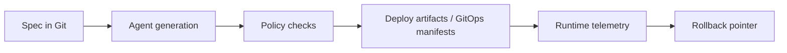

# Spec-Driven DevOps PoC

This repository demonstrates one vertical slice of a spec-driven DevOps system:

`Spec -> Agent -> Policy -> Deploy -> Observe -> Rollback`

The goal is not to show a perfect production platform. It is to show how a small team can move from a requirement to a running, observable, reversible change with reviewable artifacts and machine-enforced controls.

## Architecture

### Spec layer
- Versioned YAML specs live in `applications/expense-workflow-service/specs/`.
- The baseline is `BASELINE.yaml`; feature specs describe one small change over that baseline.
- Specs define the business intent, API contract, deployment intent, and observability assertions.

### Agent layer
- `devops/agent/` reads the resolved spec and generates release artifacts and service code.
- The agent supports a deterministic path for repeatability and an Ollama-backed path for local LLM generation.
- Ollama runs locally and acts as the model endpoint for code generation.

### Policy layer
- `devops/policy/` validates generated artifacts and generated code against the resolved spec.
- Rego policies run through `scripts/gate.sh` when `opa` is available.
- Python checks always run to write evidence files under `build/releases/<release_id>/evidence/`.

### GitHub Actions
- `.github/workflows/spec-driven-build.yml` is the orchestration entrypoint.
- The workflow uses a self-hosted runner because the pipeline depends on local services and stateful tools such as Ollama, OPA, and the workspace artifacts.
- The workflow resolves a spec, runs generation, runs policy gates, and then publishes generated workspace artifacts.

### GitOps and deployment
- `devops/k8s/` contains generated Kubernetes manifests for the demo service.
- `devops/k8s/argocd/` contains the Argo CD application definitions.
- Minikube is used as the local cluster target when the demo is run end-to-end.
- Rollback is pointer-based in the local PoC: the active release is switched through `deploy/current`.

### Observability
- Runtime verification is handled by `devops/observability/verify_behavior.py`.
- The optional Minikube observability stack uses OpenTelemetry, Alloy, Tempo, and Grafana.

## Workflow



Step-by-step flow:

1. A change is captured as a versioned spec in Git.
2. The agent resolves the spec against the baseline and generates code plus release artifacts.
3. Policy gates compare the generated output to the spec and fail fast on mismatches.
4. Approved artifacts are promoted into the deployment path or GitOps manifests.
5. The service runs and emits metrics, traces, and audit events.
6. Verification scripts check that runtime behavior matches the spec.
7. Rollback is not fully automated yet. We currently use Argo CD to manage rollback manually, so if a new pod crashes, Kubernetes and Argo CD do not automatically replace the current pod.

## Step-by-Step Setup Guide

If you want to run this PoC perfectly on your local machine (macOS/Docker recommended), follow these steps in order:

### 1. Install & Configure Ollama
The agent uses local LLM generation to avoid sending proprietary specs to cloud endpoints.
1. Download and install [Ollama](https://ollama.com/).
2. Pull the model used in this PoC:
   ```bash
   ollama run qwen2.5:7b
   ```
3. Keep the Ollama server running. By default, it runs on `http://127.0.0.1:11434`.

### 2. Set up Kubernetes (Minikube)
We use Minikube with the Docker driver to simulate a real cluster.
1. Start the cluster with sufficient resources:
   ```bash
   minikube start --driver=docker --memory=6144 --cpus=4
   ```
2. Enable the ingress addon so we can route internal traffic locally:
   ```bash
   minikube addons enable ingress
   ```

### 3. Install Argo CD & GitOps
Argo CD acts as our deployment controller, syncing manifests from Git into Minikube.
1. Install Argo CD into the cluster:
   ```bash
   kubectl create namespace argocd
   kubectl apply -n argocd -f https://raw.githubusercontent.com/argoproj/argo-cd/stable/manifests/install.yaml
   ```
2. Apply the PoC application definition (this watches the `devops/k8s` directory in this repo):
   ```bash
   kubectl apply -f devops/argocd/application.yaml
   ```
3. Access Argo CD locally:
   ```bash
   kubectl port-forward svc/argocd-server -n argocd 8080:443
   ```
   Navigate to `https://localhost:8080`. (Default username: `admin`, get password with `kubectl -n argocd get secret argocd-initial-admin-secret -o jsonpath="{.data.password}" | base64 -d`)

### 4. Enable Local Network Routing (Crucial for Demo)
Because Docker isolates the Minikube network on macOS, you must start the Minikube tunnel in a separate background terminal to access services via LoadBalancer/Ingress:
```bash
minikube tunnel
```
*(Leave this running. It will prompt for your Mac password to bind privileged ports like 80/443 for the Ingress Controller).*

### 5. Setup Self-Hosted GitHub Runner
Because our GitHub Actions workflow needs to reach the local Ollama instance and deploy to the local Minikube cluster, you must run it on a self-hosted runner.
1. Go to your GitHub repository -> **Settings** -> **Actions** -> **Runners**.
2. Click **New self-hosted runner** and select your OS (e.g., macOS).
3. Follow the provided commands to download, extract, and configure the runner in a local directory.
4. Run the runner:
   ```bash
   ./run.sh
   ```
Once connected, pushes to the `dev` branch will trigger the pipeline directly on your machine.

### 6. Set up the Observability Stack (Optional)
To verify metrics and traces, deploy the OpenTelemetry / Grafana Alloy / Tempo / Grafana stack into the `monitoring` namespace.
```bash
helm repo add grafana https://grafana.github.io/helm-charts
helm repo update
kubectl apply -f devops/monitoring/minikube/namespace.yaml
```

### 7. Accessing UIs & Backend 
Since you are developing locally inside Minikube, use `kubectl port-forward` to access various dashboards and the backend service. Keep these running in separate terminal tabs:

**Argo CD (GitOps Dashboard)**
```bash
kubectl port-forward svc/argocd-server 8080:443 -n argocd
```
- URL: `https://localhost:8080`
- Username: `admin`
- Password: `kubectl -n argocd get secret argocd-initial-admin-secret -o jsonpath="{.data.password}" | base64 -d`

**Grafana (Observability Dashboard)**
```bash
kubectl port-forward svc/grafana 8001:3000 -n monitoring
```
- URL: `http://localhost:8001`
- Username: `admin` 
- Password: `admin` (default)

**Backend Pod (Expense Workflow Service)**
```bash
kubectl port-forward svc/expense-workflow 3001:80 -n devops-ssd-assignment
```
- URL: `http://localhost:3001`
- You can now run `make verify APP_URL=http://localhost:3001` to test the API.

- `applications/expense-workflow-service/`: demo business service, specs, generated code, and tests.
- `devops/agent/`: spec resolution and generation logic.
- `devops/policy/`: Rego and Python policy gates plus evidence writers.
- `devops/observability/`: runtime verification and monitoring manifests.
- `devops/k8s/`: Kubernetes and Argo CD manifests generated from the spec.
- `devops/scripts/`: local orchestration helpers for demo, rollback, and bootstrap flows.
- `docs/`: design notes, requirements, and ADRs.

## Issues I have faced

- Rego version drift caused policy parse failures until the rules were migrated to OPA v1 syntax.
- The gate initially validated the raw feature spec instead of the resolved spec, which produced false failures on inherited baseline fields.
- Ollama generation can return JSON-like literals or invalid contract output, so the contract path needs normalization before writing Python modules.
- A simple Ollama endpoint health check is not enough; the real generation prompt is much heavier and needs a longer timeout. 
- Generated files can crash the container if they are not normalized to valid Python, so validation must happen before the artifact is used at runtime.

## Improvements

- Make Ollama generation more resilient with retries, warm-up, and clearer fallback behavior.
- Extend the automation beyond application code so it also generates Kubernetes manifests and Argo CD application resources from the spec. The agent should handle code, tests, manifests, and GitOps artifacts, while the quality gate verifies the generated output.
- Expand observability assertions so each spec has explicit runtime checks. I also want to add custom metrics and make sure the model can handle them correctly from an OpenTelemetry perspective.
- Improve the rollback strategy. Right now rollback is handled manually through Argo CD, but I want it to be automatic. For example, if a new pod crashes, Kubernetes and Argo CD should not keep the failed state; the system should retry, rebuild, test, and create a new loop.

## Demo Focus

The main demo currently centers on the `expense-workflow-service` and shows how a small API change moves through the full pipeline with traceable artifacts and policy enforcement.

## Feature Branch Workflow

For spec-driven development work, `feat/*` branches now follow a small review-first workflow:
1. **Spec Scan**: detect exactly one changed spec under `applications/*/specs/*.yaml`.
2. **Spec Validation**: validate the resolved spec first and fail the pipeline immediately on policy errors.
3. **Generate Code & Artifacts**: run deterministic generation and upload the generated output as workflow artifacts.
4. **Create Pull Request**: open or reuse a PR from the `feat/*` branch to `main`.

Notes:
- This workflow does not deploy.
- This workflow does not perform rollback.
- The agent does not commit directly in this stage.
