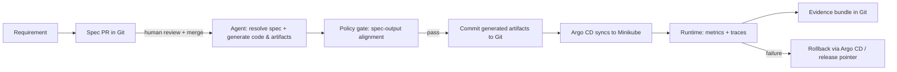

# Target-State Design

## 1. Context and objective

Enterprise profile:
- Team: ~5 engineers.
- Estate: ~20 business applications across internal and customer-facing surfaces.
- Controls: SOC 2 and GDPR in scope.

Design goal:
- Move from code-push-centric DevOps to a **spec-driven lifecycle** where requirements are versioned artifacts, agents implement against those specs, and governance evidence is generated by default.

Primary success criterion:
- Every change is traceable from approved spec → generated artifact → policy report → running deployment → observed telemetry, with a reversible path at any stage.

---

## 2. Lifecycle (requirement to running change)

Actors and responsibilities:
- **Human:** Write spec, open PR, review agent output, approve merge.
- **Agent:** Resolve spec, generate code, manifests, and evidence — never commits or deploys directly.
- **GitHub Actions (self-hosted runner):** Orchestrate generation, gate, build, and publish; requires local runner because pipeline depends on Ollama and local workspace state.
- **Policy engine:** Python + OPA/Rego checks that validate generated output against the spec before artifacts are committed.
- **Argo CD:** Watches the Git repo and reconciles the cluster state; handles deploy and rollback by managing the Git-tracked manifest state.
- **Observability stack:** Runtime metrics, traces, and audit events confirm that behavior matches what the spec declared.

---

## 3. Building blocks

### 3.1 Agentic coding and orchestration

| Tool | Decision |
|---|---|
| Python agent (`devops/agent/`) | **Selected.** Lightweight, visible, easy to audit. Supports deterministic mode and Ollama-backed LLM mode. |
| Ollama (`qwen2.5:7b`) | **Selected.** Local, open-source LLM runtime. CI pipeline enforces that the Ollama provider is used in non-trivial code generation runs. |
| LangGraph / AutoGen | Ruled out for PoC: multi-agent complexity adds setup overhead without adding clarity to a single vertical slice. |
| Closed SaaS agents | Ruled out: violates open-source constraint. |

### 3.2 Spec and change control

- YAML specs in Git (`applications/*/specs/`), PR-reviewed before agent runs.
- Baseline spec (`BASELINE.yaml`) is the stable reference; feature specs describe one delta over it.
- The agent resolves the merged spec before generation.

### 3.3 Policy-as-code

| Tool | Decision |
|---|---|
| Python checks (`devops/policy/check_spec_alignment.py`, `check_generated_code_alignment.py`) | **Selected.** Always run; write evidence JSON. |
| OPA + Rego (`devops/policy/spec_validation.rego`) | **Selected.** OPA v1 syntax; runs via `scripts/gate.sh` when `opa` is available. |
| Runtime-only admission (e.g. Gatekeeper) | Ruled out: too late in the pipeline; we need pre-deploy checks to catch spec mismatches before artifacts reach the cluster. |

### 3.4 CI/CD

| Tool | Decision |
|---|---|
| GitHub Actions + self-hosted macOS runner | **Selected.** Self-hosted because the pipeline needs Ollama, OPA, and minikube access from the same host. |
| Cloud-hosted runners | Ruled out: Ollama and local cluster are not reachable. |

### 3.5 Deployment and GitOps

| Tool | Decision |
|---|---|
| Minikube | **Selected.** Local Kubernetes cluster for demo; mirrors production intent without cloud cost. |
| Argo CD | **Selected.** GitOps reconciler; watches `devops/k8s/` and syncs to Minikube. Handles rollback by reverting Git state. |
| Docker Compose (local pointer) | Used in early PoC for rapid local iteration with `deploy/current` symlink; still present but K8s path is the primary demo path. |

### 3.6 Observability

| Tool | Decision |
|---|---|
| FastAPI `/metrics` (Prometheus format) | **Selected.** Runtime conformance assertions call this endpoint. |
| OpenTelemetry (OTLP) | **Selected.** Applications emit traces; Grafana Alloy collects and forwards. |
| Grafana Alloy | **Selected.** Collector and pipeline for traces and metrics. |
| Grafana Tempo | **Selected.** Trace backend. |
| Grafana | **Selected.** Dashboards and trace exploration. |
| Full tracing stack in initial PoC scope | Deferred: PoC initially proved behavior through Prometheus metrics alone; OTel stack was added as the system matured. |

---

## 4. Human-agent boundary (risk-based)

**Agent does autonomously (low/medium risk):**
- Resolve spec against baseline.
- Generate application code, tests, release artifacts, and K8s manifests.
- Write policy evidence files.
- Update `image-tag.yaml` in GitOps manifests.

**Agent does under review (medium/high risk):**
- Any generated change touching auth, PII fields, or data retention paths requires human review before the PR is merged.

**Agent never does (hard boundary):**
- Commit or push to Git directly (only CI/CD does this, and only after gate passes).
- Deploy to production or apply manifests outside of the GitOps reconciliation loop.
- Access secrets or credentials.
- Bypass the policy gate.

Rationale: boundaries follow blast radius, not trust in model output quality.

---

## 5. Governance by construction

Evidence produced automatically per release:

| artifact | where |
|---|---|
| Versioned spec with Git history | `applications/*/specs/` |
| Codegen report (provider, files generated) | `build/releases/<id>/evidence/codegen-report.json` |
| Policy report (pass/fail + violations) | `build/releases/<id>/evidence/policy-report.json` |
| Code policy report | `build/releases/<id>/evidence/code-policy-report.json` |
| Pipeline log | `.logs/pipeline.log` |
| Runtime telemetry | Grafana / Prometheus metrics endpoint |
| Argo CD sync history | Argo CD UI + Git commit history |

SOC 2/GDPR alignment:
- **Change management:** PR-reviewed specs, immutable release artifacts, GitOps-managed deploys.
- **Access/control:** policy gate is the enforcement boundary between agent output and the cluster.
- **Auditability:** evidence chain is machine-generated, not manually assembled.
- **Data minimization:** spec can declare prohibited fields; policy checks enforce.

---

## 6. Rollout risks and adoption metrics

Expected risks:
- Team friction: writing specs before coding is a habit change.
- Agent output quality variance, especially with a small local model.
- OPA/Rego version drift causing false failures (already encountered in this PoC).
- Self-hosted runner dependency on local services creates fragility in CI.

Mitigations:
- Start with one service, one change class, one policy rule.
- Gate is deterministic and explicit: failures show exact violation.
- Ollama endpoint health check before generation + timeout handling.
- Keep policy checks simple and additive.

Adoption signals:
- % of spec changes that pass the gate without manual override.
- Lead time: spec merge → running deployment.
- Rollback frequency and mean time to rollback.
- Evidence completeness rate per release.

---

## 7. PoC alignment (what is actually running)

This PoC demonstrates one narrow vertical slice with the `expense-workflow-service`:

1. **Spec:** `EXPENSE-finance-approval.yaml` adds a finance approval stage for expenses ≥ 1000.
2. **Agent:** resolves spec + baseline, calls Ollama (`qwen2.5:7b`) to generate code and manifests.
3. **Policy gate:** Python + Rego checks catch threshold mismatches, missing swagger docs, or contract violations before artifacts are committed.
4. **Build:** GitHub Actions (self-hosted) builds a container image inside Minikube and updates `image-tag.yaml`.
5. **GitOps:** Argo CD syncs `devops/k8s/expense-workflow-service/` to the `devops-ssd-assignment` namespace in Minikube.
6. **Observe:** `verify_behavior.py` submits requests, checks Prometheus metrics, and asserts spec-declared behavior.
7. **Rollback:** Argo CD reverts to a previous Git state; local pointer rollback via `devops/scripts/rollback.sh` also remains available for fast iteration.
