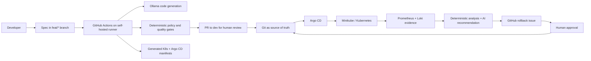
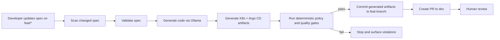
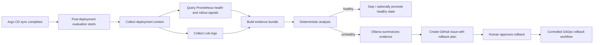

# Target-State Design

## 1. Objective

This PoC demonstrates a pragmatic **spec-driven DevOps** model where business changes start as reviewed specifications, code and deployment artifacts are generated by agents, and deployment decisions remain controlled by deterministic gates plus human approval.

The system is designed around two workflows:

1. **Spec-driven delivery**: move a reviewed spec change into generated application and GitOps artifacts, then into a human-reviewed PR.
2. **Post-deployment monitoring and rollback recommendation**: evaluate a deployed change using deterministic telemetry checks, then use AI only to explain evidence and recommend whether rollback should be considered.

Core principle: **the agent can generate and reason, but it does not directly deploy or rollback.**

---

## 2. Architecture Overview

### Main components

| Component | Role |
|---|---|
| YAML specs in `applications/*/specs/` | Source artifact for intended behavior and deployment shape |
| GitHub Actions + self-hosted runner | Orchestrates validation, generation, gating, and controlled Git updates |
| Ollama | Local LLM backend for code/artifact generation and evidence summarization |
| Policy and quality checks | Deterministic verification of specs and generated output |
| Argo CD | Reconciles Git-tracked manifests into Kubernetes |
| Minikube | Local cluster target for the PoC |
| Prometheus | Source of deployment and health metrics |
| Loki | Centralized log source for incident evidence |
| AI monitoring agent | Produces rollback reasoning and recommendation from collected evidence |

---

## 3. Workflow 1: Spec-Driven Delivery

### Intent

Developers change the system by editing **specs**, not by directly implementing application code first. The platform then generates the code, tests, and deployment artifacts from that spec and routes them through deterministic validation before anything is proposed for merge.

### Delivery flow

### Branch strategy

- Feature work starts on `feat/*` branches.
- The expected user input is a spec change under `applications/*/specs/*.yaml`.
- The pipeline treats Git as the control plane: generated code and manifests are committed back to the branch, reviewed in Git, and merged through a PR into `dev`.

### Responsibilities

**Developer**
- Writes or updates the spec.
- Describes intended behavior, API contract, deployment intent, and quality expectations.
- Reviews generated output in the PR before merge.

**GitHub Actions**
- Detects the changed spec in the feature branch.
- Validates the spec before generation starts.
- Runs the generator and policy gates on the self-hosted runner.
- Creates or updates the PR to `dev` if the generated result passes.

**Agent via Ollama**
- Reads the spec and baseline context.
- Generates application code, tests, and deployment artifacts.
- Produces Kubernetes manifests and the Argo CD application definition for the target service.

**Policy / quality layer**
- Enforces deterministic validation of both the spec and generated output.
- Stops the workflow on mismatches or unsupported output.

### Why this workflow matters

- **Git remains the source of truth**: Argo CD deploys only what exists in Git.
- **The agent is productive but constrained**: it can generate artifacts, but it cannot bypass review.
- **Human review stays in the loop**: merging to `dev` is the approval boundary for generated changes.
- **Deterministic gates protect the system**: policy evaluation is explicit, reproducible, and not delegated to the model.

---

## 4. Workflow 2: Post-Deployment Monitoring and Rollback Recommendation

### Intent

After a change is deployed through GitOps, the system evaluates whether the new version is healthy. Detection is based on deterministic telemetry checks. AI is used only after evidence is gathered, to interpret the situation and recommend whether rollback should be proposed.

### Monitoring and rollback flow

### Evidence model

The evaluation phase builds a structured evidence set from:

- **Deployment context**: app name, current image/tag, previous healthy version, manifest location, health endpoint.
- **Prometheus metrics**: rollout state, deployment health, and infrastructure signals.
- **Loki logs**: centralized application logs for failure context.
- **Derived analysis artifacts**: deterministic health assessment plus AI-generated explanation when needed.

### Responsibilities

**Deterministic monitoring layer**
- Starts after deployment.
- Resolves the current and previous deployment state.
- Uses Prometheus metrics to assess rollout and health conditions.
- Collects logs from Loki as supporting evidence.
- Produces a deterministic recommendation baseline from the gathered signals.

**AI monitoring agent**
- Consumes the evidence bundle.
- Explains likely failure cause and summarizes rollback rationale.
- Produces a recommendation, not an action.

**GitHub workflow / issue process**
- Opens a GitHub issue when rollback should be considered.
- Includes rollback context and the proposed GitOps diff or target version.
- Waits for explicit human approval before changing GitOps state.

**Human / DevOps approver**
- Reviews the evidence and rollback plan.
- Approves or rejects rollback.
- Owns the final risky action.

### Design constraints

- Rollback is **not executed directly by the agent**.
- AI does **not** decide health on its own; it reasons over evidence gathered by deterministic checks.
- GitOps state changes only through the controlled rollback workflow after approval.

---

## 5. Human-Agent Boundary

### Agent may do autonomously

- Read spec inputs and baseline artifacts.
- Generate code, tests, Kubernetes manifests, and Argo CD application manifests.
- Summarize post-deployment evidence and propose rollback reasoning.

### Agent may do only under review

- Introduce generated application behavior that changes business logic.
- Propose rollback plans for a live deployment.

### Agent must never do

- Deploy directly to Kubernetes outside GitOps.
- Roll back a deployment directly without workflow approval.
- Bypass policy gates.
- Mutate production intent outside controlled Git commits and review flow.

---

## 6. Agent Boundary And Governance

The agent is strictly a **reasoning and proposal layer**. It can assist delivery and operations, but it is not a control-plane actor.

### Agent is allowed to

- Generate code from spec.
- Analyze monitoring signals.
- Produce recommendations.
- Create GitHub issues.

### Agent is not allowed to

- Commit directly to any branch, including `dev`.
- Merge pull requests.
- Modify GitOps state.
- Trigger rollback execution.
- Perform any direct cluster mutation.

### Governance model

All state-changing actions must go through:

- Deterministic pipelines.
- Policy and quality gates.
- Human approval.

This keeps authority split across three layers:

- **Agent proposes**
- **Pipeline executes**
- **Human approves**

---

## 7. Design Principles

- **Specs are the primary development interface** for change intent.
- **Git is the source of truth** for both delivery and rollback state.
- **Policy gates are deterministic** and run before risky transitions.
- **Monitoring detection is deterministic**; AI is used for reasoning and recommendation.
- **Human approval is required** before merging generated changes and before rollback-related GitOps changes.
- **Agents assist engineering judgment**; they do not replace control points.
- **Agent proposes, pipeline executes, human approves** is the governing control pattern.

---

## 8. Summary

This design keeps the useful parts of AI in the delivery loop without giving the model unsafe authority. In the delivery path, Ollama accelerates generation from reviewed specs while deterministic gates and human PR review protect GitOps state. In the runtime path, Prometheus and Loki provide objective signals, and AI adds operational reasoning only after evidence has been collected.

The result is a system where **generation is automated, deployment is GitOps-controlled, monitoring is evidence-based, and rollback remains a deliberate human-approved action**.
