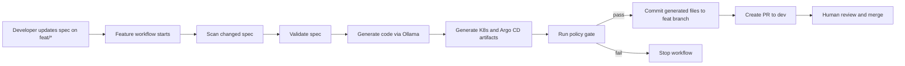

# PoC 1: Spec-Driven Delivery

## Objective

This PoC shows how a developer can introduce a new application change by updating a spec first, then letting the platform generate the application and deployment artifacts through a controlled workflow.

The main idea is simple:

- The developer edits a spec on a `feat/*` branch.
- The pipeline validates the spec.
- The agent generates code and GitOps artifacts.
- Deterministic policy gates verify the generated result.
- A PR is created to `dev` for human review.

The agent helps with generation, but it does not deploy directly and it does not merge the PR.

---

## Workflow

---

## What the developer does

- Create or update a spec under `applications/*/specs/`.
- Push the change on a `feat/*` branch.
- Review the generated code, manifests, and PR content.
- Decide whether to merge into `dev`.

In this model, the spec is the main input artifact, not handwritten app code.

---

## What the pipeline does

The feature workflow performs these steps:

1. Detect exactly one changed spec file in the feature branch.
2. Validate the spec before generation starts.
3. Run code generation through Ollama.
4. Generate or update Kubernetes manifests and the Argo CD application resource.
5. Run deterministic policy checks on the generated output.
6. Commit generated changes back to the same feature branch.
7. Create or reuse a PR into `dev`.

This keeps Git as the source of truth for both generated code and deployment intent.

---

## Examples of policy gates

The pipeline uses deterministic checks such as:

- The spec must include required fields like `schema_version`, `change_id`, `service`, `workflow_change`, `deployment`, `docs`, and `quality`.
- Only schema version `1.0.0` is accepted.
- `workflow_change.baseline_stages` must exist and must not be empty.
- `quality.unit_tests.required` must be `true`.
- `quality.unit_tests.min_new_tests` must be at least `1`.
- The spec must define Swagger information through `docs.swagger.path` or `docs.swagger.url`.
- The generated application must include `GET /health` and `GET /metrics`.
- The generated routes must match the API routes declared in the spec.
- The generated contract values must match the resolved spec values.

These checks are important because they make sure the generated result is still constrained by explicit rules.

---

## Human control points

- The generated output is reviewed in Git before merge.
- The PR to `dev` is the approval boundary for the delivery flow.
- The workflow does not deploy directly from the feature branch.

Control model:

- Agent proposes.
- Pipeline executes.
- Human approves.

---

## Outcome

If everything passes, the output is a reviewed PR into `dev` that contains:

- The updated spec.
- Generated application code.
- Generated tests.
- Generated Kubernetes manifests.
- The Argo CD application manifest.

This PoC demonstrates a spec-first delivery model where AI is used for generation, but release control stays with deterministic pipelines and human review.
