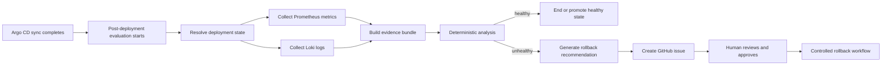

# PoC 2: Post-Deployment Monitoring And Rollback Recommendation

## Objective

This PoC shows how the system evaluates a deployment after Argo CD sync, collects evidence from the runtime environment, and creates a rollback recommendation when the deployment looks unhealthy.

The key design choice is:

- Detection is deterministic.
- AI is used for reasoning and recommendation.
- Rollback still requires human approval.

---

## Workflow

---

## What happens after deployment

After Argo CD syncs the new version, the post-deployment evaluation flow starts.

The workflow first resolves the current deployment state, including:

- Current image and tag
- Previous deployed version
- Last known healthy version
- Application name and manifest path
- Health endpoint and runtime context

This context becomes part of the evidence bundle.

---

## Deterministic monitoring

The monitoring workflow uses deterministic checks to decide whether the deployment looks healthy.

Main evidence sources:

- **Prometheus**: deployment health, rollout signals, and infrastructure metrics
- **Loki**: centralized application logs
- **Deployment context**: image tag, app name, namespace, and previous healthy version

This stage is intentionally not model-driven. The system first collects objective runtime signals before asking the AI layer to summarize anything.

---

## AI recommendation layer

If the deployment looks unhealthy, the evidence bundle is passed to the AI monitoring layer.

The AI layer is used to:

- summarize the failure evidence
- explain the likely issue in plain language
- recommend whether rollback should be considered

The AI layer is not allowed to execute rollback directly.

---

## Rollback proposal and approval

When rollback is recommended, the system creates a GitHub issue with the rollback context.

That issue can include:

- the affected service
- the change ID
- the current deployed version
- the previous healthy target
- a rollback diff or rollback plan

A human then reviews the proposal and decides whether to approve it.

Only after approval does the controlled rollback workflow update GitOps state.

---

## Human and system boundaries

The monitoring and rollback design follows these boundaries:

- Prometheus and Loki provide the evidence.
- Deterministic checks identify whether the deployment is healthy or unhealthy.
- AI explains the evidence and proposes a next step.
- A human approves any risky action.
- GitOps state is updated only through the controlled workflow.

This prevents the agent from becoming a direct production control actor.

---

## Outcome

This PoC demonstrates that post-deployment monitoring can be both automated and controlled:

- detection is based on deterministic signals
- reasoning is supported by AI
- rollback remains a human-approved GitOps action

It gives the team a practical way to connect observability, incident analysis, and rollback planning without giving the model direct authority over the cluster.
