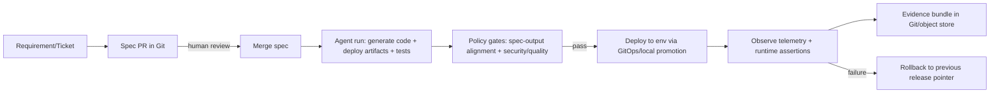

# Target-State Design (6-Month Horizon)

## 1. Context and objective

Enterprise profile:
- Team: ~5 engineers.
- Estate: ~20 business applications across internal and customer-facing surfaces.
- Controls: SOC 2 and GDPR in scope.

Design goal:
- Move from code-push-centric DevOps to a **spec-driven lifecycle** where requirements are versioned artifacts, agents implement against those specs, and governance evidence is generated by default.

Primary success criterion:
- Every production change is traceable from approved spec to observed runtime behavior with reversible deployment.

## 2. Lifecycle (requirement to running change)

Actors and responsibilities:
- Human product/ops: define change intent and risk in spec.
- Human reviewers: approve spec and high-risk generated outputs.
- Agent: transform approved spec into implementation artifacts.
- Policy engine: enforce non-negotiable controls before deploy.
- Deployment controller: promote immutable release artifact.
- Observability/evaluation jobs: verify runtime behavior against spec assertions.

## 3. Building blocks (open-source-first)

### 3.1 Agentic coding and orchestration
- Selected: lightweight Python agent workflow (extensible to LangGraph or AutoGen) + local deterministic mode for repeatable runs.
- Model access: behind open-source gateway (recommended: LiteLLM proxy in real rollout).

Considered and ruled out:
- Closed SaaS coding agents as primary runtime: violates open-source constraint/control boundary.
- Heavy multi-agent platform for PoC: too much setup for one-vertical-slice demo.

### 3.2 Spec and change control
- Selected: YAML specs in Git (`applications/expense-workflow-service/specs/*`) with PR review.
- Why: versioned, diffable, low-friction for small teams.

### 3.3 Policy-as-code
- Selected: pre-deploy policy checks as code (Python, later replaceable with OPA/Conftest for scale).
- Why: lightweight for PoC while preserving explicit machine-enforced controls.

Considered and ruled out:
- Runtime-only admission controls: too late for catching generation/spec mismatches.

### 3.4 Deployment and environment management
- Selected: local artifact promotion by release pointer (symlink), containerized app runtime.
- Why: clearly demonstrates immutable release + fast rollback without infra complexity.

### 3.5 Observability and evaluation
- Selected: Prometheus-format metrics + structured audit logs + assertion script.
- Why: telemetry can prove behavior without relying on source code inspection.

Considered and ruled out:
- Full distributed tracing stack in PoC: useful but not necessary for core assignment signal.

## 4. Human-agent boundary (risk-based)

Autonomous agent actions (low/medium risk):
- Generate implementation artifacts from approved spec.
- Generate tests/evidence files.
- Regenerate release after non-compliant output.

Agent actions requiring review (medium/high risk):
- Changes touching authn/authz logic.
- Data retention, PII fields, export paths.
- Any production rollout metadata for high-impact systems.

Agent actions disallowed (hard boundary):
- Direct production secret access.
- Unreviewed policy bypass.
- Destructive data-plane operations.

Rationale:
- Boundaries follow blast radius and compliance impact, not subjective trust in agent behavior.

## 5. Governance by construction

Evidence produced automatically at each stage:
- Spec artifact in Git with review history.
- Agent output manifest listing generated files and run mode.
- Policy report with explicit pass/fail and violations.
- Deploy/rollback history with timestamps and release IDs.
- Runtime telemetry showing declared behavior.

SOC 2/GDPR mapping (high level):
- Change management: PR-reviewed specs + immutable release artifacts.
- Access/control: policy gate as enforcement boundary.
- Auditability: machine-generated evidence chain.
- Data minimization: spec can declare prohibited data fields and policy checks enforce.

## 6. Rollout risks and adoption metrics

Expected risks:
- Team resistance to writing explicit specs before coding.
- Early policy false positives/negatives.
- Agent output quality variance.

Mitigations:
- Start with one service and one change class.
- Keep policy checks simple and deterministic first.
- Add guardrails incrementally based on violation patterns.

Adoption/quality metrics:
- Lead time: spec merge to deployment.
- Gate effectiveness: % of releases blocked for real violations.
- Rollback rate and mean time to rollback.
- Spec-runtime conformance rate from telemetry assertions.
- Evidence completeness rate per release.

## 7. PoC alignment

This PoC intentionally demonstrates one narrow flow:
- Change: add finance approval for expenses above threshold.
- Agent generates workflow/deploy artifacts.
- Gate catches threshold mismatch before deployment.
- Deployment runs locally.
- Metrics prove behavior.
- Rollback re-points to baseline release.
